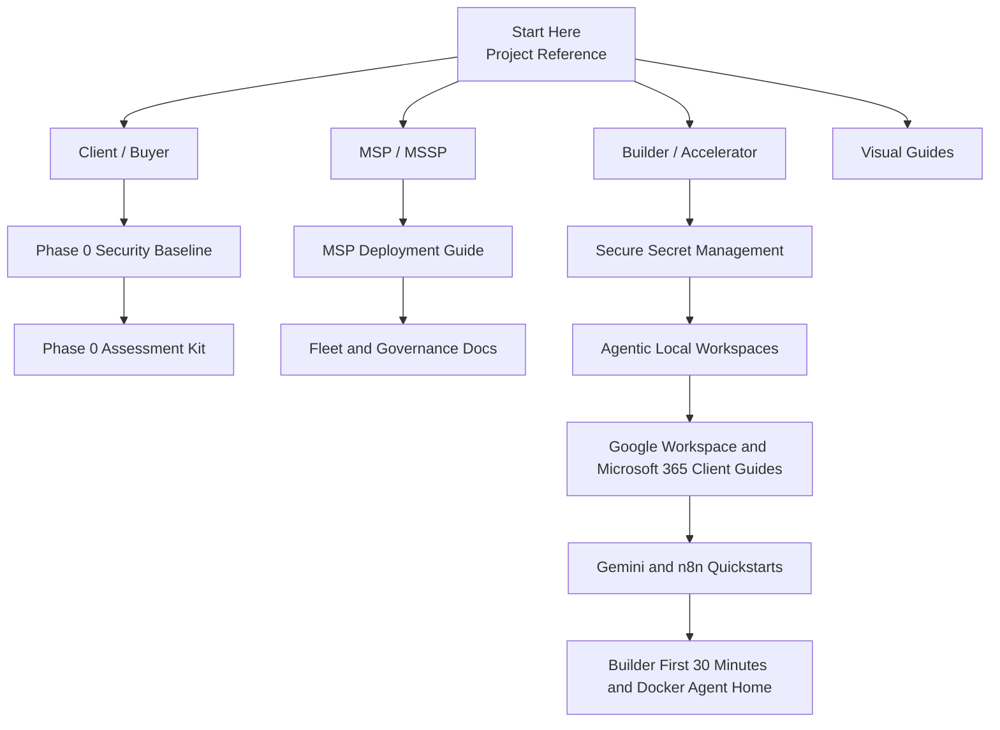

# NoeMI Audience Entry Map

This visual helps a reader find the right entry path without reading the whole repository first.

## Best Use

- send this to a new stakeholder who asks, "Where do I begin?"
- use it at the top of onboarding sessions
- keep it close to the README and the public reference
