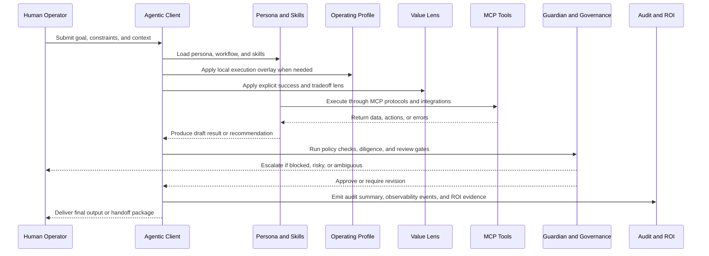

# NoeMI Runtime Flow

This visual shows how one real task moves through the system once the architecture is in place.

## What This Clarifies

- the client is the execution surface, not the repository itself
- operating profiles and value lenses are overlays, not replacements for the persona
- governance and audit happen around execution, not only after the fact
