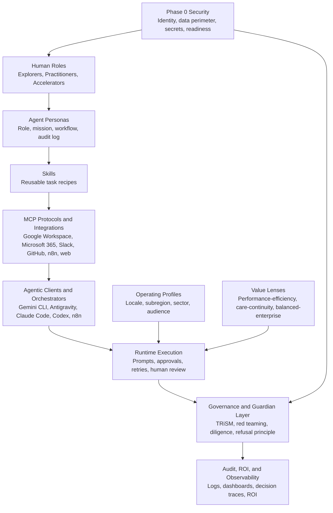

# NoeMI System Map

This is the primary architecture visual for the repository.

It shows the major layers in the order most people need to understand them.

## Read It Like This

- **Phase 0 Security** is the precondition, not a later add-on.
- **Personas, skills, and MCPs** define what agents are allowed to do and how they do it.
- **Clients and orchestrators** are the runtime surfaces that consume this repository.
- **Operating profiles** adapt work to local culture.
- **Value lenses** adapt how success and tradeoffs are judged.
- **Governance, audit, and ROI** make the system reviewable and enterprise-safe.
