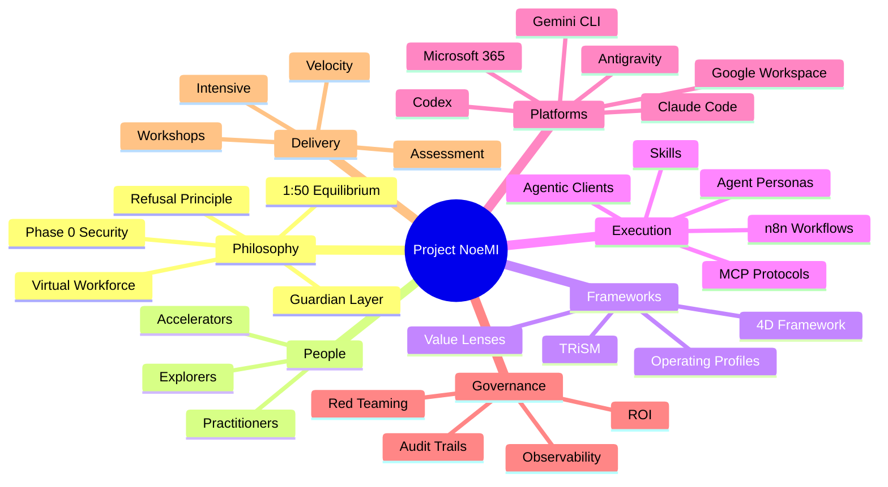

# NoeMI Workshop Mind Map

This is the supplementary exploration visual.

Use it in workshops, presentations, and onboarding conversations when people need to see the breadth of the ecosystem.

## Important Note

This is the most expansive view, not the most operational one.

If a reader needs fast comprehension, start with [`noemi-system-map.md`](noemi-system-map.md) before using this mind map.
